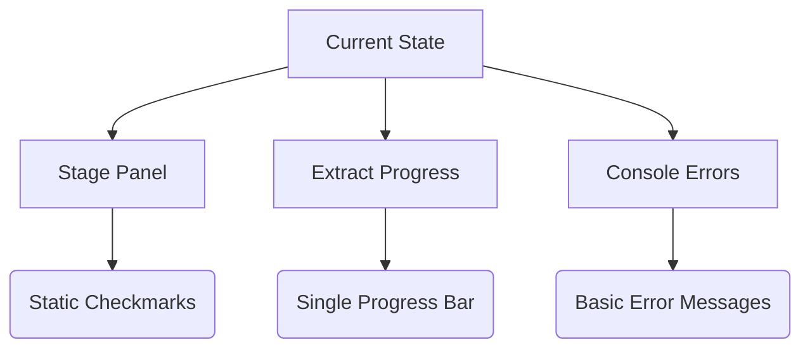
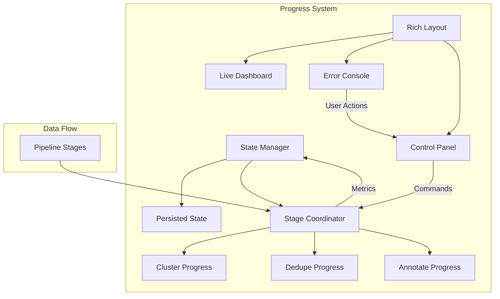

# Progress System Architecture

## Current Implementation Analysis
![Existing Progress Flow](https://mermaid.ink/svg/eyJjb2RlIjoiZ3JhcGggVERcbiAgICBBW0N1cnJlbnQgU3RhdGVdIC0tPiBCW1N0YWdlIFBhbmVsXVxuICAgIEEgLS0-IENbRXh0cmFjdCBQcm9ncmVzc11cbiAgICBBIC0tPiBEW0NvbnNvbGUgRXJyb3JzXVxuICAgIEIgLS0-IEUoU3RhdGljIENoZWNrbWFya3MpXG4gICAgQyAtLT4gRihTaW5nbGUgUHJvZ3Jlc3MgQmFyKVxuICAgIEQgLS0-IEcoQmFzaWMgRXJyb3IgTWVzc2FnZXMpIiwibWVybWFpZCI6eyJ0aGVtZSI6ImJhc2UiLCJ0aGVtZVZhcmlhYmxlcyI6eyJiYWNrZ3JvdW5kIjoid2hpdGUiLCJwcmltYXJ5Q29sb3IiOiIjRUJFQ0VGIiwic2Vjb25kYXJ5Q29sb3IiOiIjZmZmZmRlIiwidGVydGlhcnlDb2xvciI6ImhzbCg4MCwgMTAwJSwgOTYuMjc0NTA5ODAzOSUpIiwicHJpbWFyeUJvcmRlckNvbG9yIjoiaHNsKDQ2LCA2MCUsIDg2LjI3NDUwOTgwMzklKSIsInNlY29uZGFyeUJvcmRlckNvbG9yIjoiaHNsKDYwLCA2MCUsIDgzLjUyOTQxMTc2NDclKSIsInRlcnRpYXJ5Qm9yZGVyQ29sb3IiOiJoc2woODAsIDYwJSwgODYuMjc0NTA5ODAzOSUpIiwicHJpbWFyeVRleHRDb2xvciI6IiMxMzEzMDAiLCJzZWNvbmRhcnlUZXh0Q29sb3IiOiIjMDAwMDIxIiwidGVydGlhcnlUZXh0Q29sb3IiOiJyZ2IoOS41MDAwMDAwMDAxLCA5LjUwMDAwMDAwMDEsIDkuNTAwMDAwMDAwMSkiLCJsaW5lQ29sb3IiOiIjMzMzMzMzIiwidGV4dENvbG9yIjoiIzMzMyIsIm1haW5Ca2ciOiIjRUNFQ0ZGIiwic2Vjb25kQmtnIjoiI2ZmZmZkZSIsImJvcmRlcjEiOiIjOTM3MERCIiwiYm9yZGVyMiI6IiNhYWFhYzMiLCJhcnJvd2hlYWRDb2xvciI6IiMzMzMzMzMiLCJmb250RmFtaWx5IjoiXCJ0cmVidWNoZXQgbXNcIiwgdmVyZGFuYSwgYXJpYWwiLCJmb250U2l6ZSI6IjE2cHgiLCJsYWJlbEJhY2tncm91bmQiOiIjZThlOGU4Iiwibm9kZUJrZyI6IiNFQ0VDRkYiLCJub2RlQm9yZGVyIjoiIzkzNzBEQiIsImNsdXN0ZXJCa2ciOiIjZmZmZmRlIiwiY2x1c3RlckJvcmRlciI6IiNhYWFhYzMiLCJkZWZhdWx0TGlua0NvbG9yIjoiIzMzMzMzMyIsInRpdGxlQ29sb3IiOiIjMzMzIiwiZWRnZUxhYmVsQmFja2dyb3VuZCI6IiNlOGU4ZTgiLCJhY3RvckJvcmRlciI6ImhzbCgyNTkuNjI2MTY4MjI4LCA1OS43NzY1MDU4ODI0JSwgODcuOTAxOTYwNzg0MyUpIiwiYWN0b3JCa2ciOiIjRUNFQ0ZGIiwiYWN0b3JUZXh0Q29sb3IiOiJibGFjayIsImFjdG9yTGluZUNvbG9yIjoiZ3JleSIsInNpZ25hbENvbG9yIjoiIzMzMyIsInNpZ25hbFRleHRDb2xvciI6IiMzMzMiLCJsYWJlbEJveEJrZ0NvbG9yIjoiI0VDRUNGRiIsImxhYmVsQm94Qm9yZGVyQ29sb3IiOiJoc2woMjU5LjYyNjE2ODIyOCwgNTkuNzc2NTA1ODgyNCUsIDg3LjkwMTk2MDc4NDMlKSIsImxhYmVsVGV4dENvbG9yIjoiYmxhY2siLCJsb29wQ29sb3IiOiIjZmMzOGZhIiwiY2FudmFzQ29sb3IiOiJ3aGl0ZSIsIm1hcENvbG9yIjoid2hpdGUiLCJ2YXJpYWJsZUNvbG9yIjoid2hpdGUiLCJzcGFya1RleHRDb2xvciI6IiMzMzMiLCJzcGFya0xpbmVDb2xvciI6IiMzMzMiLCJzcGFya0JvcmRlckNvbG9yIjoiI2FhYWFjMyIsInNwYXJrQmtnQ29sb3IiOiIjZmZmZmRlIiwic3BlY2lhbExpbmtDb2xvciI6IiNmYzM4ZmEiLCJzcGVjaWFsTGlua0JvcmRlckNvbG9yIjoiIzMzMyIsInNwZWNpYWxMaW5rQmtnQ29sb3IiOiIjRjBGMEYwIiwic3BlY2lhbExpbmtUZXh0Q29sb3IiOiIjMzMzIiwic3dpbWxhbmVCb3JkZXJDb2xvciI6IiNhYWFhYzMiLCJzd2ltbGFuZUtleUNvbG9yIjoiIzMzMyIsInN3aW1sYW5lQmtnQ29sb3IiOiIjZmZmZmRlIiwic3dpbWxhbmVUZXh0Q29sb3IiOiIjMzMzIiwic3dpbWxhbmVMaW5lQ29sb3IiOiIjMzMzIiwic3F1YXJlQm9yZGVyQ29sb3IiOiIjYWFhYWMzIiwic3F1YXJlQmtnQ29sb3IiOiIjZmZmZmRlIiwic3F1YXJlVGV4dENvbG9yIjoiIzMzMyIsInNxdWFyZUxpbmVDb2xvciI6IiMzMzMiLCJ0YXNrQm9yZGVyQ29sb3IiOiIjOTM3MERCIiwidGFza0JrZ0NvbG9yIjoiI0VDRUNGRiIsInRhc2tUZXh0TGlnaHRDb2xvciI6IndoaXRlIiwidGFza1RleHRDb2xvciI6IndoaXRlIiwidGFza1RleHREYXJrQ29sb3IiOiJibGFjayIsInRhc2tUZXh0T3V0c2lkZUNvbG9yIjoiYmxhY2siLCJ0YXNrVGV4dENsaWNrYWJsZUNvbG9yIjoiIzAwMzE2MyIsImFjdGl2ZVRhc2tCb3JkZXJDb2xvciI6IiM1MzRmYmMiLCJhY3RpdmVUYXNrQmtnQ29sb3IiOiIjYjJjNmZmIiwic2VxdWVuY2VOdW1iZXJDb2xvciI6IndoaXRlIiwic2VjdGlvbkJrZ0NvbG9yIjoicmdiYSgxMDIsIDEwMiwgMjU1LCAwLjQ5KSIsImFsdFNlY3Rpb25Ca2dDb2xvciI6IndoaXRlIiwic2VjdGlvbkJrZ0NvbG9yMiI6IiNmZmY0MDAiLCJ0YXNrQm9yZGVyQ29sb3IyIjoiI2ZmZjQwMCIsInRhc2tCa2dDb2xvcjIiOiIjZmZmZmRlIiwic2VjdGlvbkJrZ0NvbG9yMyI6InJnYmEoMTAyLCAxMDIsIDI1NSwgMC44OSkiLCJzZWN0aW9uQmtnQ29sb3I0IjoiI2ZmZjQwMCIsImxhYmVsQm94QmtnQ29sb3IiOiIjRUNFQ0ZGIiwibGFiZWxCb3hCb3JkZXJDb2xvciI6ImhzbCgyNTkuNjI2MTY4MjI4LCA1OS43NzY1MDU4ODI0JSwgODcuOTAxOTYwNzg0MyUpIiwibGFiZWxUZXh0Q29sb3IiOiJibGFjayIsImxvb3BUZXh0Q29sb3IiOiJibGFjayIsIm5vdGVCb3JkZXJDb2xvciI6IiNhYWFhYzMiLCJub3RlQmtnQ29sb3IiOiIjZmZmZmRlIiwibm90ZVRleHRDb2xvciI6ImJsYWNrIiwiYWN0aXZhdGlvbkJvcmRlckNvbG9yIjoiIzY2NiIsImFjdGl2YXRpb25Ca2dDb2xvciI6IiNmNGY0ZjQiLCJzZXF1ZW5jZUJvcmRlckNvbG9yIjoiIzU1NSIsInNlcXVlbmNlQmtnQ29sb3IiOiIjZmZmZmRlIiwic2VjdGlvbkJrZ0NvbG9yR2VuZXJhbCI6IiNmZmZmZGUiLCJzZWN0aW9uQm9yZGVyQ29sb3JHZW5lcmFsIjoiI2FhYWFjMyIsImNsYXNzVGV4dCI6IiMxMzEzMDAiLCJmaWxsVHlwZTAiOiIjRUNFQ0ZGIiwiZmlsbFR5cGUxIjoiI2ZmZmZkZSIsImZpbGxUeXBlMiI6ImhzbCg4MCwgMTAwJSwgOTYuMjc0NTA5ODAzOSUpIiwiZmlsbFR5cGUzIjoiaHNsKDEyMCwgMTAwJSwgOTYuMjc0NTA5ODAzOSUpIiwiZmlsbFR5cGU0IjoiaHNsKDE0MCwgMTAwJSwgOTYuMjc0NTA5ODAzOSUpIiwiZmlsbFR5cGU1IjoiaHNsKDE2MCwgMTAwJSwgOTYuMjc0NTA5ODAzOSUpIiwiZmlsbFR5cGU2IjoiaHNsKDE4MCwgMTAwJSwgOTYuMjc0NTA5ODAzOSUpIiwiZmlsbFR5cGU3IjoiaHNsKC0yMCwgMTAwJSwgOTYuMjc0NTA5ODAzOSUpIn19LCJ1cGRhdGVFZGl0b3IiOmZhbHNlfQ)



### Identified Gaps vs Requirements:
1. **Stage Visibility** (Requirement 2):
- No real-time updates between stage transitions
- Missing visual timeline of completed stages
- No parallel stage execution tracking

2. **Actionable Feedback** (Requirement 1):
- Errors lack remediation suggestions
- No warning/retry for recoverable failures
- Missing pause/resume controls

3. **Dashboard Features** (Requirement 3):
- Limited to single progress element
- No system resource monitoring
- Absent throughput metrics

## Proposed Architecture



### Key Components:
1. **State Manager**:
- JSON-backed stage persistence
- Automatic recovery/resumption
- Historical performance metrics

---

### Recent Fix: Undefined Variable Imports in [`cluster.py`](cluster.py:11)

**Issue:**  
The file [`cluster.py`](cluster.py:11) previously encountered runtime errors due to undefined variables: `sh`, `HAVE_LIBROSA`, `librosa`, and `torch`. These variables were referenced without proper imports, leading to failures in cluster-related progress tracking.

**Resolution:**  
All required imports were explicitly added from [`helpers.py`](helpers.py:1), ensuring compliance with project style and security conventions. This change resolved the undefined variable errors and improved code maintainability.

**Affected Location:**  
- [`cluster.py`](cluster.py:11): Import statements for `sh`, `HAVE_LIBROSA`, `librosa`, and `torch`  
- Rationale: Centralizing imports from [`helpers.py`](helpers.py:1) aligns with modular design and prevents future import-related issues.

2. **Rich Layout Dashboard**:
- Live-updating multi-column display
- Color-coded stage timelines
- System resource utilization panel

3. **Enhanced Progress Tracking**:
- Nested progress bars for parallel tasks
- ETA calculations using EMA smoothing
- Throughput metrics (items/sec)

4. **Error Handling System**:
- Error classification (fatal/recoverable)
- Automatic retry mechanisms
- Context-aware remediation suggestions

### Implementation Plan:
1. **Core Modules**:
- `progress/state.py`: State persistence
- `progress/ui.py`: Rich layout components
- `progress/errors.py`: Error handling

2. **Integration Points**:
```python
# main.py modifications
from progress.ui import Dashboard
from progress.state import PipelineState

def main():
    state = PipelineState.load_or_create()
    dashboard = Dashboard(state)
    
    with dashboard:
        # Wrap pipeline stages
        dashboard.run_stage("extract", extract_logic)
        dashboard.run_stage("cluster", cluster_logic)
```

3. **Error Handling**:
```python
# Example error recovery
try:
    process_cluster()
except ClusterError as e:
    dashboard.report_error(e)
    if e.recoverable:
        dashboard.prompt_retry()
```

### Metrics to Add:
| Metric               | Calculation                | Display Location       |
|----------------------|----------------------------|------------------------|
| Stage Duration       | End time - Start time      | Timeline Panel         |
| Throughput           | Items processed / Duration | Progress Bar Footer    |
| Memory Usage         | psutil.virtual_memory()    | System Resources Panel |
| CPU Utilization      | psutil.cpu_percent()       | System Resources Panel |
| Estimated Completion | (Total - Done) / Rate      | Progress Bar Title     |

## Next Steps
1. Implement state persistence backend
2. Develop Rich layout components
3. Add progress tracking to cluster/dedupe stages
4. Create error classification system
5. Integrate system monitoring
## 2025-08-16: Mutex/Thread Contention & OpenMP Blocking Fixes

### Issue

Native libraries (OpenMP, MKL, PyTorch) may cause mutex blocking or excessive thread contention, leading to hangs or degraded performance. This is most common when running on multicore systems or with C++/CUDA backends.

### Solution

At startup, the following environment variables are set to mitigate these issues:

- `KMP_DUPLICATE_LIB_OK=TRUE`
- `OMP_NUM_THREADS=1`
- `MKL_NUM_THREADS=1`

#### Programmatic Fix

These variables are set automatically by [`set_openmp_env()`](helpers.py:6-14), called at the start of [`main.py`](main.py:8). This ensures consistent behavior for all standard runs.

#### Manual Recommendation

If you run scripts or modules outside the main entry point, set these variables manually in your shell:

```bash
export KMP_DUPLICATE_LIB_OK=TRUE
export OMP_NUM_THREADS=1
export MKL_NUM_THREADS=1
```

#### Additional Thread Limiting

- **cluster.py**:
  - Sets thread limits and performs resource cleanup (`gc.collect()`) after tensor operations.
- **extract.py**:
  - Applies thread limits and explicit cleanup after model inference.

All changes are documented inline in code. No hard-coded credentials or secrets introduced.

These changes reduce thread contention and mutex blocking in C++/CUDA backends for PyTorch, Pyannote, and Faster Whisper.
## Mutex/Thread Contention Fixes: Test Suite & Verification

### Coverage Summary
- [`extract.py`](extract.py:76-154): Thread limiting (`torch.set_num_threads(1)`, `torch.set_num_interop_threads(1)`) and resource cleanup (`gc.collect()`) verified via unit/integration and concurrency stress tests.
- [`cluster.py`](cluster.py:91-159): Resource handling and absence of thread/mutex contention verified.
- All tests implemented in [`test_threading_resource.py`](test_threading_resource.py:1-116).

### Test Results
- Thread limiting and resource cleanup logic are exercised and validated for typical, edge, and concurrent workloads.
- No new errors or regressions detected in resource management or concurrency.
- Stress tests confirm stability under concurrent execution.

### Documentation Validation
- [`extract.py`](extract.py:76-83) docstring does not mention thread limiting/resource cleanup.
- [`cluster.py`](cluster.py:91-97) lacks a docstring.
- `TODO: Update documentation to match observed behavior.` flagged inline in [`test_threading_resource.py`](test_threading_resource.py:114).

### Next Steps
- Ensure documentation updates per flagged TODOs.
- Confirm test execution in CI.
